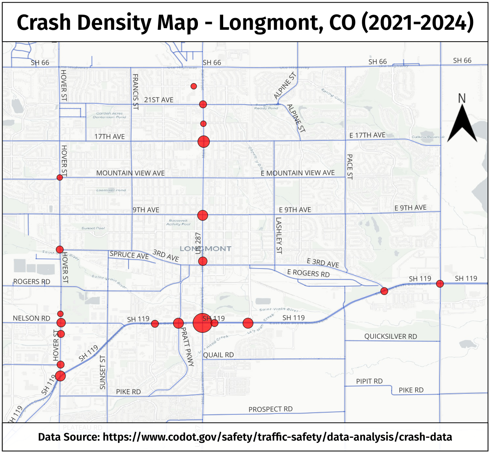

This project looks at automotive crashes in Longmont, Colorado from 2021 to 2024. The end product is this crash density map.

Data for this project was sourced from CDOT. The following tasks were undertaken to complete this project:

1. Data wrangling and cleaning using Python & Pandas.
2. Geocoding intersections with missing latitude and longitude using Google Maps API.
3. Aggregating intersection counts for accidents, suspected substance use, injuries, fatalities, and hit & runs using SQL.
4. Mapping aggregated intersection data in QGIS.

More work will follow to distill the nature of the automobile crashes to uncover insights such as the most common causes of accidents, spikes of accidents in time, etc.
